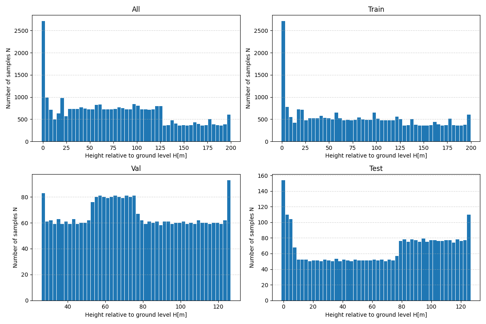
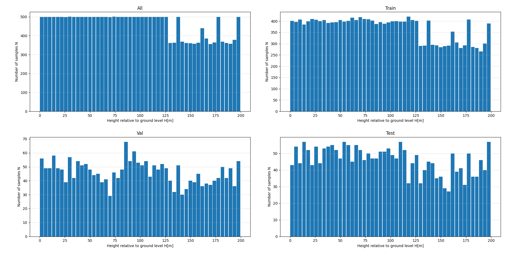

# Drone Altitude Estimation Dataset

## Overview

This branch contains tools for generating, filtering, and validating a dataset used for **altitude estimation from RGB drone camera images**.
The dataset is generated from simulation recordings containing synchronized **video frames and telemetry data**.

The dataset creation pipeline performs:

* frame extraction and telemetry synchronization
* filtering of invalid samples
* altitude-based dataset balancing
* validation through statistical visualization
* generation of telemetry visualization videos

The final dataset is intended for training **MiDaS models** to estimate drone altitude from camera images.

---

# Dataset Download

The datasets are available as compressed archives.

Download from Google Drive:

**Dataset (raw):**
https://drive.google.com/file/d/1MA9Jy5QLyIi2GjqPkO6Ak9D-XePu4d6u/view?usp=sharing

**Dataset (balanced):**
https://drive.google.com/file/d/14weDpbDxuGWnzh3xmmb56ynZJn1atnw9/view?usp=sharing

Available archive formats:

```
Dataset.zip
Dataset_balanced.zip
```

After extraction the dataset should have the following structure:

```
Dataset_balanced/
    images/
        train/
        val/
        test/

    labels/
        train.csv
        val.csv
        test.csv
```

### Dataset contents

**images/**

* RGB frames extracted from simulation recordings.

**labels/**

* CSV files containing telemetry labels associated with each frame.

CSV structure:

```
img, ax, ay, az, gx, gy, gz, mx, my, mz, barometer, lat, lon, alt
```

Where:

* `img` – image filename
* `ax, ay, az` – accelerometer data
* `gx, gy, gz` – gyroscope data
* `mx, my, mz` - magnetometer data
* `barometer` - barometer data
* `lat, lon, alt` - GPS data (latitude, longitude, altitude)
* `roll, pitch, yaw` – drone orientation

Relative altitude values below **2 meters** are removed to avoid rendering artifacts occurring when the drone camera intersects terrain geometry.

The dataset is balanced across altitude bins (4 m intervals) with a maximum of **500 samples per bin**.

---

# Branch Structure

```
branch/
    main.py
    dataset_norm.py
    dataset_val.py
    dataset_vis.py

    figures/
        hist.png
        hist_balanced.png

    README.md
```

---

# Scripts

## main.py

Generates the initial dataset from simulation recordings.

Functions:

* extracts frames from video recordings
* synchronizes frames with telemetry data
* generates CSV label files
* performs initial train/validation/test split

Output:

```
Dataset/
    images/
    labels/
```

---

## dataset_norm.py

Creates a filtered and balanced dataset.

Operations performed:

* merges train/val/test CSV files
* removes samples with altitude < 2 m
* balances altitude distribution using histogram binning
* limits samples per altitude bin
* shuffles the dataset
* generates a new train/val/test split
* copies only the selected images to the final dataset

Output:

```
Dataset_balanced/
    images/
    labels/
```

---

## dataset_val.py

Generates validation plots used to verify dataset quality and altitude distribution.

Example outputs:

## Data samples histogram (raw)



## Data samples histogram (balanced)



---

## dataset_vis.py

Generates a visualization video combining recorded frames with telemetry overlays.

Displayed telemetry information includes:

* altitude
* GPS coordinates
* orientation (roll, pitch, yaw)

Example visualization video:

https://drive.google.com/file/d/1vIGEuDR2hDpziDhaBzl3Qi15fUrR2LeW/view?usp=drive_link

The video demonstrates synchronization between image frames and telemetry data used during dataset generation.

---

# Dataset Description

Task:

```
Image → Altitude regression
```

Input:

* RGB image from drone camera

Output:

* altitude value in meters

Dataset characteristics:

```
Altitude range: 2–200 m
Image samples: ~20k–30k
Balanced altitude bins: 4 m
Maximum samples per bin: 500
```

---

# Usage

1. Download the dataset from the link above.
2. Extract the archive.
3. Place the dataset in the project directory:

```
project/Dataset/

project/Dataset_balanced/
```

4. Use the dataset in training pipelines for altitude regression models.

---

# Files Included in This Branch

**Figures**

* data samples histogram (raw dataset)
* data samples histogram (balanced dataset)

**Media**

* telemetry visualization video demonstrating synchronized telemetry overlays.

**Code**

* dataset generation scripts
* dataset filtering and balancing scripts
* dataset validation tools
* telemetry visualization generator

---

# Notes

This dataset was generated from simulation recordings and is intended for research and experimentation in computer vision and autonomous aerial navigation.
